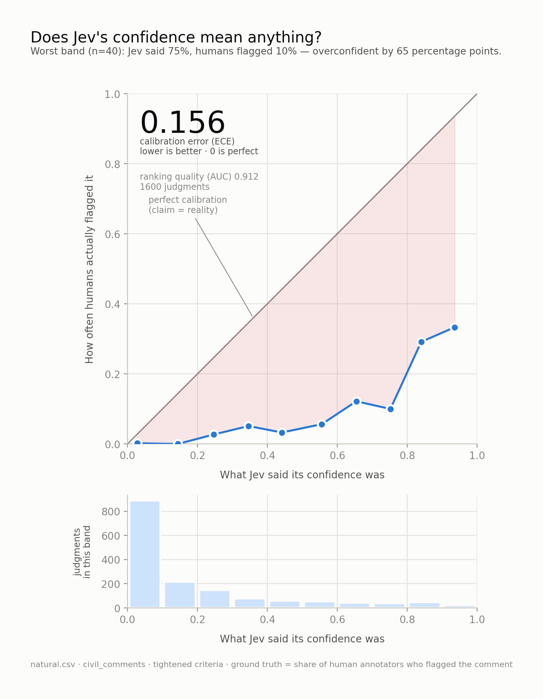

# Does Jev's confidence actually mean anything?

An audit of the probabilities returned by [TypeSafe's Jev](https://docs.typesafe.ai),
measured against human annotations rather than another model's opinion.

**8,000 judgments · 4 wordings · 2 base rates · `jev-1.13.0` · $0.05**

---

## The finding

Jev ranks well. Its probabilities are systematically shifted toward "yes," the
error grows as your positives get rarer, and a two-parameter fit removes 96% of
it without touching the ranking.



On realistic comment traffic, using the best question wording I found: when Jev
reported ~75% confidence, human annotators flagged **10%** of those comments.
Every confidence band sat below the diagonal — a systematic lean, not noise.

| run | base rate | wording | ECE ↓ | AUC ↑ | ECE after recalibration |
|---|---|---|---|---|---|
| `hard` | 19.2% | original | 0.157 | 0.903 | **0.023** |
| `natural` | 2.9% | original | 0.209 | 0.906 | **0.007** |
| `natural` | 2.9% | tightened | 0.156 | 0.912 | **0.006** |

Recalibration is fitted on one half and scored on the half it never saw. AUC
moves 0.918 → 0.918: a monotonic rescale reorders nothing, which is the proof
that the units were wrong rather than the decisions.

**This is not an argument against the model.** AUC 0.91 means it genuinely
understands the task. TypeSafe's blog says *"Calibrated: higher confidence means
higher accuracy"* — and that sentence is **true** here: the rank correlation
between stated confidence and actual flag rate is 0.96. What's false is what
engineers read into the word "calibrated", that 0.9 is a probability you can
threshold against. Their docs also say *"Start with conservative thresholds,
test with your own data, and adjust as you observe results."* This is what that
looks like when you actually do it.

As a high-recall pre-filter (recall 0.74) with a calibration layer on top, it
works. As `if p > 0.9`, it doesn't do what it looks like it does.

**The fix, as a tool:** [`jevcal`](https://github.com/Adilmp/jevcal) runs this
check against your own labelled data and learns the correction. ~100 labelled
rows, single file, numpy only.

---

## Why bother

A model that emits probabilities has two independent ways to be good, and they
fail separately:

| | question | metric | if it's bad |
|---|---|---|---|
| **Ranking** | can it tell flagged from clean at all? | AUC | the model can't do the task |
| **Calibration** | do the numbers mean what they claim? | ECE | the numbers just need rescaling |

A model can sort almost perfectly (AUC 0.95) while its probabilities are nonsense
(ECE 0.30). Reporting accuracy alone hides both facts — which is why most
"I tested model X" writeups are less useful than they look.

On the `hard` sample, `insult` at the default 0.5 threshold scored **61.0%**
accuracy where answering "no" every time scores **67.8%**. Worse than a constant
— while ranking at **AUC 0.83**. The signal is there; the threshold is in the
wrong place. That is the whole argument for measuring calibration, in three
numbers.

---

## What makes this credible

**Ground truth is human, not model-generated.**
[`civil_comments`](https://huggingface.co/datasets/google/civil_comments) shows
each comment to a panel and records *what fraction flagged it*. A `toxicity` of
0.7 means 7 in 10 real people agreed.

**The binarisation isn't doing the work.** Thresholding human agreement at 0.5 is
a choice, so the gap is also checked against the raw annotator fraction. Negative
in all 10 bands, widening at high confidence.

**The prompt objection is tested, not hand-waved.** "Your criteria were badly
worded" is the obvious critique, so step 7 runs four wordings of the same
question *in one call*, over identical state, so only the phrasing varies:

| wording | mean p | ECE | AUC |
|---|---|---|---|
| `v1_original` | 0.445 | 0.397 | 0.896 |
| `v2_annotator` — mirrors the raters' own definition | 0.566 | **0.519** | 0.881 |
| `v3_strict` — high bar, explicit exclusions | **0.259** | **0.211** | 0.913 |
| `v4_bare` — no criteria at all | 0.488 | 0.441 | 0.888 |

True base rate: 4.8%. Three results fall out. Wording matters a lot (ECE spans
0.21–0.52). Mirroring the annotators' *own* published definition was the **worst**
of the four. And AUC barely moved — **wording shifts the scale, not the signal.**
No wording fixed it: the strictest still predicted 26% where reality was 5%.

**The headline uses the best wording, not the first.** After the wording test the
whole pipeline was re-run with tightened criteria. Error fell 0.209 → 0.156 and
required human review roughly halved. The bias survived.

**Accuracy is called out as a trap.** At a 2.9% base rate, flagging nothing scores
97.1%. Step 5 prints that baseline before anything else and reports precision and
recall, because accuracy on imbalanced data is worse than useless.

---

## Run it

```bash
export JEV_API_KEY=sk-...        # or put it in .env
./run_all.sh natural             # download, query, measure, chart, thresholds
python3 6_recalibrate.py natural # can the miscalibration be fixed?
python3 7_wording.py natural     # is the bias the prompt or the model?
```

Variants:

```bash
./run_all.sh natural --strict    # tightened criteria, separate results file
./run_all.sh hard                # ambiguity-enriched sample
./run_all.sh natural --simulate  # no API key; invented data, for plumbing only
```

No dependencies beyond `numpy`, `pandas` and `matplotlib` — the API client is
plain `urllib`, and Platt scaling and isotonic regression are implemented
directly rather than pulled from `sklearn`, so every number is traceable to code
in this repo.

A full 400-comment run is ~1 cent and ~50 seconds. Step 2 caches to JSONL and
skips anything already done, so an interrupted run costs nothing to resume.
Simulated output goes to separate `*.SIMULATED.*` files and every chart is
stamped, so the two can't be confused.

Debug with `probe.py` — one request, raw response dumped — never a 400-comment run.

---

## Layout

| file | what it does |
|---|---|
| `jev.py` | the only file that knows the API's shape |
| `probe.py` | one request, raw response — the debugging tool |
| `1_get_data.py` | downloads comments, builds two samples |
| `2_ask_jev.py` | one call per comment, four questions per call |
| `3_measure.py` | buckets by confidence; ECE, Brier, AUC |
| `4_chart.py` | reliability diagram |
| `5_thresholds.py` | how much could you safely automate, and where |
| `6_recalibrate.py` | Platt + isotonic, fitted and scored on separate halves |
| `7_wording.py` | four wordings, one call, same state |

**Two samples, on purpose.** `natural.csv` is a random draw at a 2.9%
judgment-level base rate — what a real queue looks like. `hard.csv` spreads
evenly across the toxicity range so the ambiguous middle is actually
represented. I expected `hard` to be worse. It was the reverse, and that
inversion is the base-rate finding.

**Four questions per call.** Jev evaluates several questions against one shared
state in a single request, so every comment yields four judgments — toxicity,
insult, threat, obscene — and `civil_comments` has a human agreement rate for
each.

---

## Limitations

- **One dataset, one domain, one model version.** Everything here is
  `civil_comments` and `jev-1.13.0`. The harness runs on any labelled data for
  pennies; a second domain would strengthen it a lot.
- **`threat` is not interpretable and I'm leaving it in anyway.** Natural traffic
  contains **one** positive in 400. Every `threat` number in this repo — AUC
  0.80, ECE 0.03 — is built on a single labelled example and means nothing.
  Deleting it would have been tidier and less honest; it is here so the
  per-question tables are complete, and it should never be cited.
- **The wording lesson was extrapolated.** Four wordings were tested on `insult`
  only, then applied to all four questions. `toxicity` improved less
  (0.339 → 0.258) than `insult` did (0.397 → 0.282).
- **Four wordings is four, not all of them.** Someone may find a better one.
- **Majority-vote human labels are not neutral.** Annotator pools carry their own
  biases, particularly around dialect and reclaimed slurs. Jev disagreeing with
  the panel is not automatically Jev being wrong.
- **Step 5's thresholds hold only if production traffic resembles the sample.**
  Comparing `natural` against `hard` shows how much that assumption is worth.
- **A Noul has no separate confidence field.** For a yes/no question the
  probability *is* the confidence — which is exactly why it's worth auditing.
  There's no second number to fall back on.

## What I'd do next

- Run it on a second domain — support tickets or fraud flags — to test whether
  the "yes" lean is a property of the model or of this dataset.
- Ship the calibration map as a reusable wrapper rather than an analysis step.
- Test whether the bias tracks the base rate predictably enough to correct from
  a prior alone, without labelled data.
